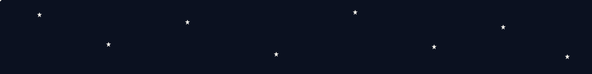

<div align="center">

<!-- BANNER -->


<!-- TYPING ANIMATION -->
<a href="https://git.io/typing-svg">
  
</a>

<br>


</div>

<br>

## ✶ Sobre mim

```ts
const julia = {
  cargo: "Dev Web",
  stack: ["JavaScript", "React.js", "HTML5", "CSS3", "Node.js", "TypeScript"],
  interesses: ["front-end", "back-end", "boas práticas de UI"],
  status: "sempre aprendendo e construindo algo novo"
};
```

Transformo interfaces em experiências e ideias em código. Curto tanto deixar uma tela bonita e funcional quanto entender o que acontece por trás, no back-end.

<br>

## ✶ Tecnologias

<div align="left">
  
  
  
  
  
  
</div>

<br>

## ✶ Projetos

<!-- Preencha os cards abaixo com seus repositórios -->

<div align="left">


</div>

<br>


<!-- ═══════════ ESTATÍSTICAS ═══════════ -->
## `> estatisticas`

<div align="center">
  
  
</div>

<div align="center">
  
</div>


<!-- ═══════════ ACTIVITY GRAPH ═══════════ -->
## `> atividade`

<div align="center">
  
</div>


<!-- ═══════════ TROPHIES ═══════════ -->
## `> trophies`

<div align="center">
  
</div>


<br>

## ✶ Estrelas Cadentes

<div align="center">
  
</div>

<br>

## ✶ Redes Sociais

<div align="center">
  <a href="https://www.linkedin.com/in/julia-siqueira-547ba8428/" target="_blank">
    
  </a>
  <a href="https://www.instagram.com/juliasiqueira.j" target="_blank">
    
  </a>
</div>

<br>

<div align="center">
  
  <sub>✶ Feito com café, código e algumas estrelas ✶</sub>
</div>
